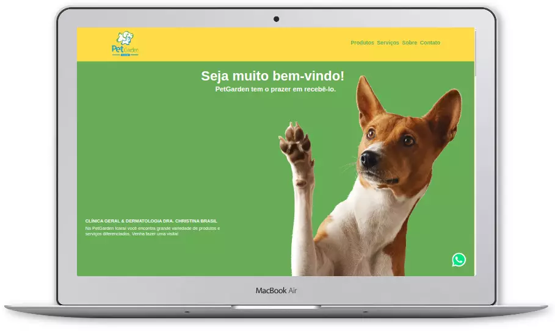

# PetShop V1

Neste pequeno projeto, irei desenvolver um site fictício para um PetShop local.

A ideia surgiu como desafio no curso ProgramadorBr, onde nós alunos recebemos um desafio de encontrarmos algum negócio aleatório que ainda não possua um site e/ou que já tenha o site e refazermos um modelo diferente, dessa forma então criaremos uma página para essa empresa simulando como se estivéssemos sido contratados por ela para realizar esta tarefa.

Como o site é referente a uma empresa que trabalha no ramo de PetShop, a ideia é mostrar informações mais relevantes sobre o negócio, como por exemplo os serviços que ela fornece e que ajudem futuros clientes que estão buscando pela internet por algum PetShop na região e assim atraiam esses novos clientes.

## Tecnologias usadas

  
  

## Preview

Live Demo: https://diegosouza007.github.io/PetShop/